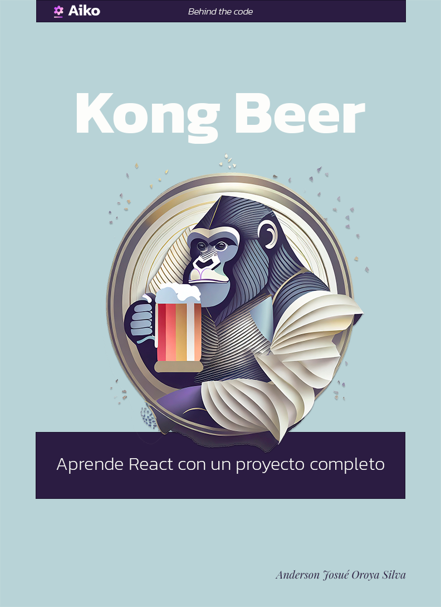

# React JS - Cookbook - Kong Beer

Copyright © 2023 by Anderson Josué Oroya Silva

El siguiente contenido es material educativo de soporte para mis cursos de React JS.

Se ha puesto mucho esfuerzo en la preparación de este material para garantizar la exactitud de la información presentada. No obstante, queda en responsabilidad del lector cualquier tipo de aplicación que pueda generar presuntos daños de forma directa o indirecta.

Autor: Anderson Josué Oroya Silva

Fecha de publicación: 26 de Septiembre de 2023 Córdoba, Argentina

[www.oroyajs.com](http://www.oroyajs.com/)

## Prefacio

Tengo el agrado de crear y diseñar el contenido para mis cursos de React JS. Personalmente considero que enseñar React JS a desarrolladores Frontend en formación es algo que aporta mucho al crecimiento de dicho perfil profesional. Durante mis años como profesor de desarrollo web he visto más de una vez que aprender esta librería UI de JavaScript supone muchos desafíos para mis estudiantes. Este libro es una recopilación de las experiencias ganadas enseñando y aprendiendo React JS.

El objetivo de este libro/curso es aprender todos los aspectos de la API de React JS y aplicarlos en un proyecto de ejemplo llamado Kong Beer, esta es una página de eCommerce ficticia que vende cervezas 🍻. Al final de este camino, podrás llevar estos conocimientos a otros tipos de proyectos usando React JS.

## Contenido de este repositorio

Este repositorio da soporte a lo visto en clase y ayuda a profundizar un poco más en los conceptos vistos. Es por eso que los temas a abarcar son:

1. Javascript Overview *(Un breve repaso por JavaScript)*
2. Manipulación del DOM con Vanilla-JS
3. Introducción a React JS
