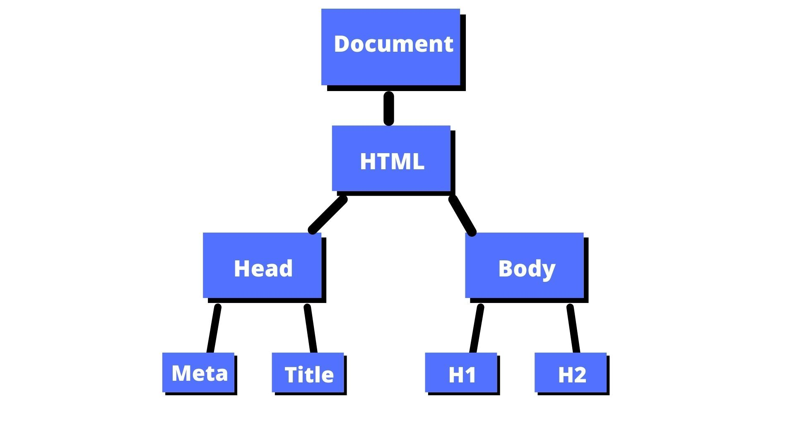

# Manipulación del DOM con Vanilla-JS

Cuando abres una página web en tu navegador, el navegador recupera el texto HTML de la página y lo analiza. El navegador entonces construye un modelo de la estructura del documento y utiliza este modelo para dibujar la página en la pantalla.

Este modelo se llama **DOM** (Document Object Model) y es una representación de la página web que se puede manipular con un lenguaje de programación como JavaScript.

Veamos el siguiente ejemplo:

```html
<!DOCTYPE html>
<html>
  <head>
    <title>DOM</title>
  </head>
  <body>
    <h1>DOM</h1>
    <h2>El DOM es una representación del documento HTML.</h2>
  </body>
</html>
```

El DOM para este documento se vería así:



Esta representación del documento es uno de los elementos con los que cuenta un programa JavaScript en su entorno. Es una estructura de datos que puedes leer o modificar. Actúa como una estructura de datos en vivo: cuando se modifica, la página en la pantalla se actualiza para reflejar los cambios.

La estructura de datos que utiliza el navegador para representar el documento sigue esta forma. Para cada caja, hay un objeto con el que podemos interactuar para averiguar cosas como qué etiqueta HTML representa y qué cajas y texto contiene. A esta representación se le llama Modelo de Objeto de Documento, o DOM por sus siglas en inglés.


## Para qué sirve el DOM

En términos generales, el DOM nos permite acceder a todos los elementos de una página web y modificarlos. Por ejemplo, podemos cambiar el texto de un elemento, añadirle una clase, eliminarlo, etc.

Alguna vez te preguntaste - ¿cómo es que cuando haces click en un botón, se ejecuta una función? - Todo esto es posible gracias al DOM.

Por lo tanto, podemos crear aplicaciones o páginas web interactivas gracias a la manipulación del DOM.


