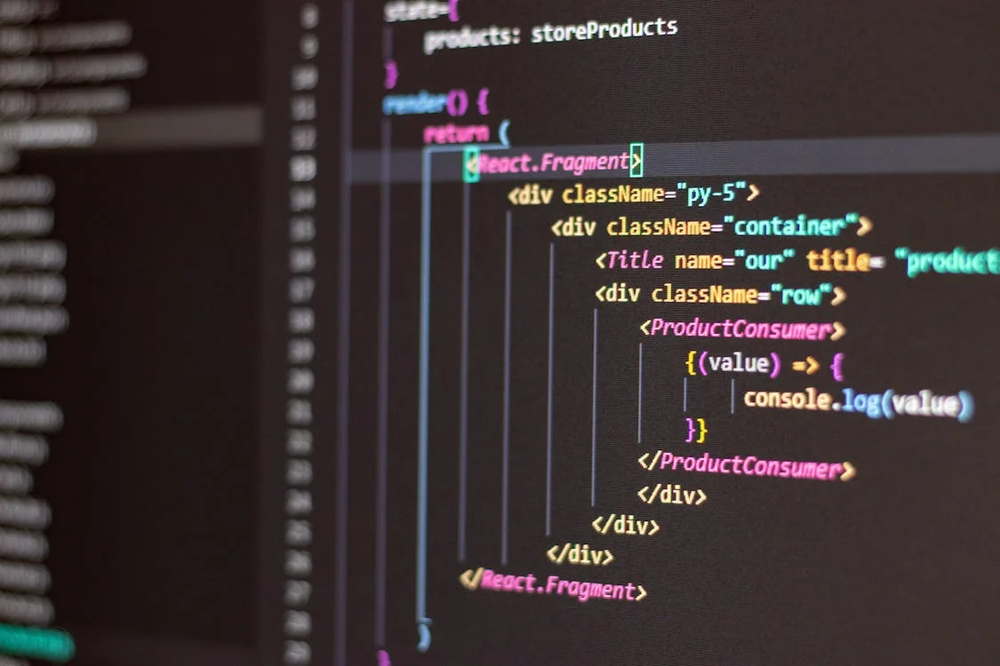

# Introducción a React

El objetivo principal de este capítulo es enseñarte sobre la configuración de proyectos de React y los conceptos fundamentales de React.

Nuestro primer paso será configurar un entorno de desarrollo para React.

A continuación, crearás tu primer proyecto configurando todas las configuraciones por ti mismo. Construiremos una aplicación de React desde cero para aprender cómo funciona React detrás de escena. Durante este proceso, te presentaré a Vite.js. Después de eso, procederemos a crear una aplicación de React utilizando Vite.js.

Discutiremos acerca de qué son los componentes y el Lenguaje de Marcado Extensible de JavaScript (JSX). Aprenderás sobre los conceptos del Virtual DOM, props y estado. Explicaré estos conceptos con la ayuda de nuestro proyecto principal: Kong Beer 🍻.

El capítulo te llevará al emocionante mundo de Componentes, JSX, props, estado, etc., utilizando un proyecto de ejemplo, y servirá como base para aprender React. Asegúrate de comprender los conceptos y fundamentos antes de finalizar cada sección. Al final de este capítulo, estarás en una buena posición para experimentar y aprender características distintas de React. Comencemos construyendo un entorno de software.
