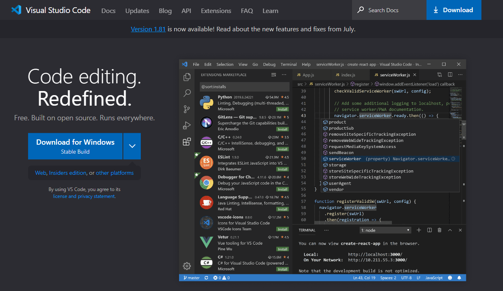

# Entorno de desarrollo

Comencemos construyendo un entorno de software. Para ello, necesitaremos instalar Node.js y un editor de código. En este curso, usaremos Visual Studio Code, pero puedes usar el editor de código que prefieras.


> Empezar algo es hacer el 50 por ciento de ese algo que tenemos que hacer.
>
> -*Anónimo*

## Instalación de Node JS

Como sabrás JavaScript es un lenguaje que nació en el navegador, digamos que durante sus primeros años, cuando JavaScript aún era un adolescente, este nunca había salido de casa.

Fue un 27 de mayo de 2009 cuando entra en acción Node.js, hasta antes de eso JavaScript no podía ser tomando en cuenta como un lenguaje que se pudiera ejecutar en una máquina como una aplicación independiente. Este gran hecho abrió muchas posibilidades a los desarrolladores de JavaScript, quienes de pronto podrían desempeñar un papel importante en el backend de una aplicación Web.

Si es que ya tienes instalado Node.js en tu computadora, puedes adelantarte a este paso siempre y cuando cuentes con la versión 16 en adelante. Para saber si ya cuentas con Node.js en tu computadora y corroborar la versión, puedes abrir tu terminal de comandos y tipear:

```shell
node --version
```

*output*: `v18.14.0`

En el caso de que quieras actualizar tu versión de Node.js, puedes hacerlo desinstalando primero Node.js en la sección de "Agregar o quietar programas de Windows". Para usuarios de Mac, existen otras formas más traumáticas.

### Instalación:

- Vamos a ir a la página de [Node.js](https://nodejs.org/es) y haremos clic en la versión LTS la cual es siempre la versión más estable independientemente del año y la versión en la que nos encontremos.


* Una vez descargado el archivo con extensión .exe, lo ejecutaremos para hacer clic


* No vamos a tocar ninguna configuración aquí, así que te recomiendo hacer "Next" a todo.
* Una vez que la instalación esté confirmada, podés abrir tu terminal de windows (Powershell) para correr el comando

  ```shell
  node --version
  ```

  *output*: `v18.17.0`

  Deberías poder ver la versión de tu Node.js, de lo contrario te sugiero reiniciar la terminal o la computadora y si es que el problema persiste, por favor repite todos los pasos.

## Gestor de paquetes NPM

El gestor de paquetes NPM se instala junto con la instalación de Node.js así que puedes correr el siguiente comando para corroborar que se haya instalado correctamente:

```shell
npm --version
```

Esta es una mención especial al paquete NPM, ya que es hoy por hoy como la biblioteca de Alejandría de los desarrolladores. NPM es una plataforma donde se albergan muchísimas librerías que nos proveen de herramientas ya sea de código abierto o con algunas licencias. Entre ellas, tenemos a React.js o incluso Angular.

## Instalación de Visual Studio Code

Para instalar Visual Studio Code, vamos a ir a la página oficial de [Visual Studio Code](https://code.visualstudio.com/) y vamos a hacer clic en el botón de descarga.



Una vez descargado el archivo con extensión .exe, lo ejecutaremos para hacer clic en "Next" a todo.

### Extensiones recomendadas para Visual Studio Code

A continuación, te voy a recomendar algunas extensiones que te van a ayudar a mejorar tu experiencia de desarrollo con Visual Studio Code.

- **[Auto Rename Tag](https://marketplace.visualstudio.com/items?itemName=formulahendry.auto-rename-tag)**: Esta extensión nos permite renombrar etiquetas HTML de forma automática. Por ejemplo, si renombramos la etiqueta de apertura de un elemento, la de cierre se renombrará automáticamente.
- **[Material Icon Theme](https://marketplace.visualstudio.com/items?itemName=PKief.material-icon-theme)**: Esta extensión nos permite cambiar los iconos de los archivos y carpetas por unos más coloridos y llamativos.
- **[Prettier](https://marketplace.visualstudio.com/items?itemName=esbenp.prettier-vscode)**: Esta extensión nos permite formatear nuestro código de forma automática. Por ejemplo, si tenemos un código con sangrías incorrectas, Prettier lo corregirá automáticamente.
- **[ES7+ React/Redux/React-Native snippets](https://marketplace.visualstudio.com/items?itemName=dsznajder.es7-react-js-snippets)**: Esta extensión nos permite escribir código de React de forma más rápida. Por ejemplo, si queremos crear un componente de React, solo tenemos que escribir "rcc" y automáticamente se creará el componente.

Encuentra estas o más extensiones en el [marketplace de Visual Studio Code.](https://marketplace.visualstudio.com/VSCode) Para instalarlas, solo debes hacer clic en el botón de instalar y listo.
