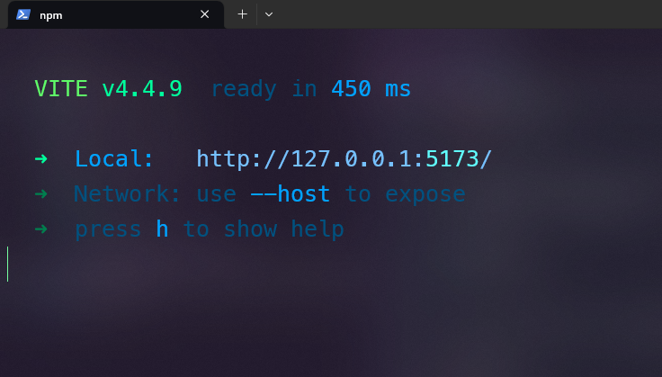

# React JS

Con el paso de los años, ha habido una creciente demanda de formas sencillas para componer interfaces de usuario utilizando JavaScript. React, también conocido como React.js, es una biblioteca JavaScript de código abierto diseñada por Facebook, utilizada para construir interfaces de usuario o componentes de UI.

Es decir, con React Podremos construir pequeños bloques de cógido llamado componentes que irán conformando nuestra aplicación. Estos componentes se pueden reutilizar en diferentes partes de la aplicación, lo que nos permite ahorrar tiempo y esfuerzo.

Podemos encontrar mucha información sobre React en su [página oficial](https://es.react.dev/).

## ¿Por qué React?

No es un secreto que hoy en día existen muchas bibliotecas y frameworks para desarrollar aplicaciones web. Sin embargo, React se ha convertido en una de las herramientas más populares para desarrollar interfaces de usuario. Esto se debe a que React es una biblioteca muy flexible y fácil de usar, que nos permite crear interfaces de usuario interactivas. Además, React es muy rápido y escalable, lo que lo hace ideal para aplicaciones de una sola página.

## Creando un proyecto con React

En este capítulo, crearemos un proyecto de React desde cero. Generalmente se recomienda usar una CLI (Command Line Interface) para crear un proyecto de React llamada [Create React App](https://create-react-app.dev/). Sin embargo, esta herramienta resulta muy lenta y pesada, por lo que en este curso crearemos nuestro proyecto con [Vite](https://vitejs.dev/), una herramienta que nos permite crear proyectos de React de forma rápida y sencilla.

### Vite JS:

Vite.js es un entorno de desarrollo ultrarrápido para construir aplicaciones web modernas. Está diseñado para ser más rápido que otros sistemas de construcción tradicionales, como Webpack, al adoptar un enfoque basado en la importación. En lugar de agrupar y compilar todo el código por adelantado, Vite.js aprovecha las capacidades nativas del navegador para cargar módulos de manera eficiente a medida que se solicitan.

Vite.js es particularmente eficiente durante el desarrollo, ya que reduce el tiempo de espera al recargar o compilar el código. Utiliza la sintaxis de módulos nativa de JavaScript (ES modules) y permite a los desarrolladores trabajar con una variedad de lenguajes y marcos, incluidos JavaScript, TypeScript, React, Vue.js y más.

En resumen, Vite.js es una herramienta de desarrollo que se centra en la velocidad y la eficiencia al crear aplicaciones web modernas mediante la carga rápida de módulos y la optimización del flujo de trabajo de desarrollo. Es por eso que la usaremos para desarrollar nuestra aplicación de Kong Beer.

### Creando un proyecto de React con Vite:

Para crear un proyecto de React con Vite, debemos ejecutar el siguiente comando en la terminal:

```bash
npm create vite@latest
```

Luego, elegiremos el nombre del proyecto:

```bash
project name: kong-beer
```

Y por último, elegiremos el framework que usaremos:

```bash
Select a framework: react
```

**Nota:** Es importante poder deplazarse con las flechitas de arriba y abajo para seleccionar la opción deseada. Es por eso que te recomiendo usar Windows PowerShell en Windows o tu terminal de comandos en Mac.

Elegiremos también el lenguaje de programación que usaremos:

```bash
Select a variant: javascript
```

Tendremos que ver algo así:


Como resultado final veremos las siguientes indicaciones:

```bash
Scaffolding project in C:...\kong-beer...

Done. Now run:

  cd kong-beer
  npm install
  npm run dev
```

Es importante poder usar la terminal para navegar hasta la carpeta del proyecto:

```bash
cd kong-beer
```

Y luego instalar las dependencias del proyecto:

```bash
npm install
```

**Nota:** Si queremos abrir VS Code con el proyecto, este es un buen punto para hacerlo. Para ello, podemos ejecutar el siguiente comando:

```bash
code .
```

Por último, ejecutaremos el proyecto:

```bash
npm run dev
```

Y veremos algo así:



Si abrimos nuestro navegador en la dirección que indica la terminal como local veremos lo siguiente:


Por otro lado, si abrimos nuestro proyecto en VS Code, veremos la siguiente estructura de archivos:


¡Perfecto! Ya tenemos nuestro proyecto de React listo para empezar a trabajar.

Kong Beer es una aplicación que nos permitirá comprar cervezas ficticias. A continuación, empezaremos a trabajar en la interfaz de usuario de la aplicación.