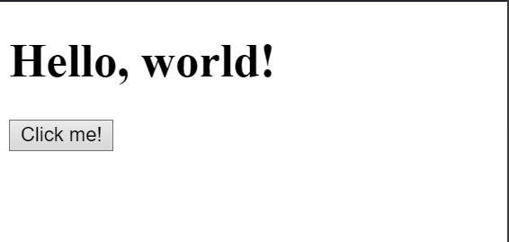

# Primeros pasos con React

El objetivo de esta sección es entender cómo funciona React JS en el navegador. Para ello trabajaremos exclusivamente con HTML, CSS y JavaScript. No introducidemos aún JSX, ni ningún otro elemento de la estructura que previamente armamos con Vite.js en la sección anterior.

La idea es ver el código puro de React, aquello que está sucediendo detrás de escena. Esto hará que seas más eficiente, sobre todo cuando tengas que depuerar tu código.

Imagina que estás ante un hermoso auto deportivo, antes de usarlo veremos dentro del capó para entender cómo funciona.

## React en su forma más pura

Para empezar, crearemos un nuevo proyecto dentro de una carpeta a la que llamaremos `pure-react`. Dentro de esta carpeta crearemos un archivo llamado `index.html`

La estructura de nuestro repositorio será la siguiente:

```bash
pure-react
├── index.html
```

Dentro de `index.html` escribiremos el siguiente código:

```html
<!DOCTYPE html>
<html>
  <head>
    <meta charset="UTF-8" />
    <title>Pure React</title>
  </head>
  <body>
    <div id="root"></div>
  </body>
</html>
```

Este código es el mínimo necesario para que nuestro navegador pueda interpretar el código de React. En la etiqueta `body` hemos creado un `div` con un `id` llamado `root`. Este `div` será el punto de entrada de nuestra aplicación.

Ahora, le añadiremos a nuestro `index.html` unos scripts de importación de React y React DOM. Para ello, añadiremos el siguiente código dentro de la etiqueta `head`:

```html
<!DOCTYPE html>
<html>
  <head>
    <meta charset="UTF-8" />
    <title>Pure React</title>
    <script src="https://unpkg.com/react@18/umd/react.development.js"></script>
    <script src="https://unpkg.com/react-dom@18/umd/react-dom.development.js"></script>

    <!-- Don't use this in production: -->
    <script src="https://unpkg.com/@babel/standalone/babel.min.js"></script>
  </head>
  <body>
    <div id="root"></div>
  </body>
</html>
```

Estos scripts nos permitirán importar React y React DOM en nuestro proyecto. Además, también hemos añadido un script de Babel para poder usar JSX en nuestro código. **Nota:** No es recomendable usar Babel en producción, ya que ralentiza la aplicación.

Ahora, añadiremos una etiqueta `script` al final de nuestro `body` para poder escribir código JavaScript en nuestro archivo `index.html`. Dentro de esta etiqueta escribiremos el siguiente código:

```html
<!DOCTYPE html>
<html>
  <head>
    <meta charset="UTF-8" />
    <title>Pure React</title>
    <script src="https://unpkg.com/react@18/umd/react.development.js"></script>
    <script src="https://unpkg.com/react-dom@18/umd/react-dom.development.js"></script>

    <!-- Don't use this in production: -->
    <script src="https://unpkg.com/@babel/standalone/babel.min.js"></script>
  </head>
  <body>
    <div id="root"></div>
    <script type="text/babel">
      function MyApp() {
        return <h1>Hello, world!</h1>;
      }

      const container = document.getElementById("root");
      const root = ReactDOM.createRoot(container);
      root.render(<MyApp />);
    </script>
  </body>
</html>
```

Como puedes ver, hemos creado una función llamada `MyApp` que retorna un elemento `h1` con el texto `Hello, world!`. Luego, hemos creado una constante llamada `container` que hace referencia al `div` con `id` `root` que creamos anteriormente. Por último, hemos creado una constante llamada `root` que hace referencia a `ReactDOM.createRoot(container)`. Esta constante nos permitirá renderizar el elemento `MyApp` dentro del `div` con `id` `root`. Para ello, usamos el método `render` de `root` y le pasamos como parámetro el elemento `MyApp`.

* ReactDOM: Es una librería que nos permite renderizar elementos de React en el navegador.
* ReactDOM.createRoot(container): Es un método que nos permite crear un elemento raíz para renderizar elementos de React en el navegador.
* .render(element): Es un método que nos permite renderizar un elemento de React en el navegador.

- **Nota:** En este ejemplo estamos usando `ReactDOM.createRoot(container)` para renderizar el elemento `MyApp`. Sin embargo, también podríamos usar `ReactDOM.render(<MyApp />, container)` para lograr el mismo resultado.

Si abrimos nuestro navegador con el archivo `index.html` veremos lo siguiente:


También puedes ver este código en StackBlitz haciendo click [aquí](https://stackblitz.com/edit/web-platform-tyhblc?file=script.js).

**Nota:** Si no estás familiarizado con la manipulación del DOM con JavaScript, te recomiendo ver el capítulo 2, sección `02-DOM-Vanilla-JS` de este libro.

## Virtual DOM

Como mencionamos en su momento en el capítulo 2, sección `02-DOM-Vanilla-JS`, el DOM es una representación de la estructura de nuestro documento HTML. Cuando el navegador interpreta nuestro código HTML, crea una representación de este en memoria. Esta representación es la que se conoce como DOM.

Cuando usamos React, no estamos manipulando directamente el DOM. En su lugar, estamos manipulando una representación de este que se conoce como Virtual DOM. Esta representación es una copia del DOM que se encuentra en memoria. Cuando hacemos cambios en el Virtual DOM, React se encarga de actualizar el DOM.


Como se puede apreciar en la imagen, a través del método `render` de `root`, enviamos el elemento `MyApp` al Virtual DOM. Luego, React se encarga de actualizar el DOM con los cambios que se hayan realizado en el Virtual DOM.

Básicamente, enviaremos elementos que en adelante llamaremos componentes al Virtual DOM. Estos componentes serán funciones que retornen elementos de React. Por ejemplo, el componente `MyApp` que creamos anteriormente es una función que retorna un elemento `h1` con el texto `Hello, world!`. 


## Actividad: Crear un componente Button

Ahora, crearemos un componente llamado `Button` que renderice un botón en el navegador. Para ello, crearemos una función llamada `Button` que retorne un elemento `button` con el texto `Click me!`. Luego, renderizaremos este componente en el navegador.

Para ello, añadiremos el siguiente código dentro de la etiqueta `script` de nuestro `index.html`:

```html
<!DOCTYPE html>
<html>
  <head>
    <meta charset="UTF-8" />
    <title>Pure React</title>
    <script src="https://unpkg.com/react/umd/react.development.js"></script>
    <script src="https://unpkg.com/react-dom/umd/react-dom.development.js"></script>

    <!-- Don't use this in production: -->
    <script src="https://unpkg.com/@babel/standalone/babel.min.js"></script>
  </head>
  <body>
    <div id="root"></div>
    <script type="text/babel">
      function MyApp() {
        return <h1>Hello, world!</h1>;
      }

      function Button() {
        return <button>Click me!</button>;
      }

      const container = document.getElementById("root");
      const root = ReactDOM.createRoot(container);
      root.render(<MyApp />);
      root.render(<Button />);
    </script>
  </body>
</html>
```

Como puedes ver, hemos creado una función llamada `Button` que retorna un elemento `button` con el texto `Click me!`. Luego, hemos renderizado este componente en el navegador a través del método `render` de `root`.

Si abrimos nuestro navegador con el archivo `index.html` veremos lo siguiente:


Y es que, como puedes ver, hemos renderizado el componente `Button` en el navegador. Sin embargo, no hemos renderizado el componente `MyApp`. Esto se debe a que, cuando llamamos al método `render` de `root` por segunda vez, este reemplaza el elemento anterior por el nuevo elemento que le pasamos como parámetro.

Para solucionar este problema, podemos crear un componente que contenga a ambos componentes. Por ejemplo, podemos crear un componente llamado `App` que contenga a los componentes `MyApp` y `Button`. Para ello, añadiremos el siguiente código dentro de la etiqueta `script` de nuestro `index.html`:

```html
<!DOCTYPE html>
<html>
  <head>
    <meta charset="UTF-8" />
    <title>Pure React</title>
    <script src="https://unpkg.com/react/umd/react.development.js"></script>
    <script src="https://unpkg.com/react-dom/umd/react-dom.development.js"></script>

    <!-- Don't use this in production: -->
    <script src="https://unpkg.com/@babel/standalone/babel.min.js"></script>
  </head>
  <body>
    <div id="root"></div>
    <script type="text/babel">
      function MyApp() {
        return <h1>Hello, world!</h1>;
      }

      function Button() {
        return <button>Click me!</button>;
      }

      function App() {
        return (
          <div>
            <MyApp />
            <Button />
          </div>
        );
      }

      const container = document.getElementById("root");
      const root = ReactDOM.createRoot(container);
      root.render(<App />);
    </script>
  </body>

</html>
```

Como puedes ver, hemos creado una función llamada `App` que retorna un elemento `div` que contiene a los componentes `MyApp` y `Button`. Luego, hemos renderizado este componente en el navegador a través del método `render` de `root`.

Si abrimos nuestro navegador con el archivo `index.html` veremos lo siguiente:




## Conclusiones

En este capítulo hemos aprendido cómo funciona React en el navegador. Hemos aprendido que React no manipula directamente el DOM, sino que lo hace a través de una representación de este que se conoce como Virtual DOM. También hemos aprendido que podemos renderizar elementos de React en el navegador a través de `ReactDOM.render(element, container)` o `ReactDOM.createRoot(container).render(element)`.

En la próxima sección, aprenderemos a usar JSX para crear elementos de React de una forma más sencilla usando la estructura que previamente armamos con Vite.js en la sección anterior.
