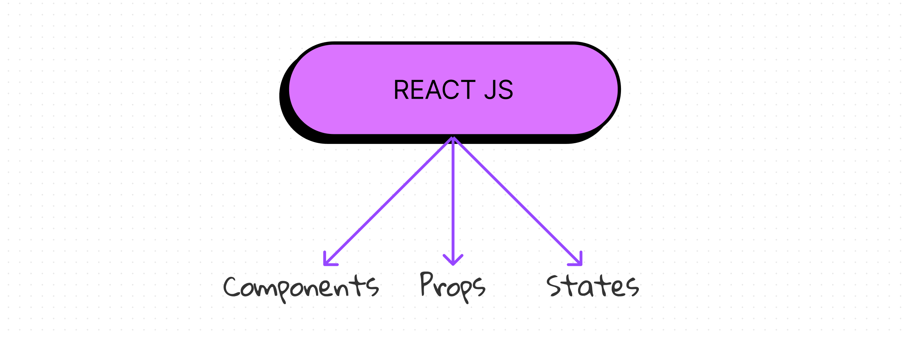

# Componentes, props y estados

Si pudiésemos resumir React en 3 palabras, estas serían: **componentes**, **props** y **estados**. En este capítulo veremos qué son y cómo funcionan.



Components, props y states son los tres conceptos clave en React. Virtualmente todo lo que vas a ver o hacer en React se puede clasificar en al menos uno de estos conceptos clave

## Objetivos de esta sección

- Limpiar el proyecto para su inicio
- Configurar algunos estilos globales con css
- Entender qué son los componentes y cómo funcionan.
- Aprender a crear componentes en React.
- Aprender a usar props en React.
- Entender cómo se comunican los componentes entre sí.
- Aprender a usar estados en React.
- Entender qué papel juegan los estados en los componentes.

## Continuación del proyecto Kong Beer

En este capítulo también retomaremos el proyecto Kong Beer que comenzamos en el capítulo anterior. Si no lo has hecho, te recomiendo que lo hagas antes de continuar.

Por el momento solo tenemos la estructura que nos generó Vite, pero en este capítulo comenzaremos a trabajar en el proyecto.

### Limpieza del proyecto

Antes de empezar a trabajar en el proyecto, vamos a hacer una pequeña limpieza. Para ello, vamos a borrar lo siguiente:

#### Logo de Vite `public/vite.svg`

Este archivo no lo vamos a necesitar, por lo tanto, podemos borrarlo. Sin embargo, si lo hacemos, debemos borrar también la referencia a este archivo en `index.html`:

```html
<link rel="icon" href="/vite.svg" />
```

#### Logo de Rect `src/assets/react.svg`

Al eliminar este ar

#### Estilos de Vite `src/index.css`

Si bien mantendremos el archivo `index.css`, vamos a borrar todo su contenido. Esto se debe a que vamos a definir nuestros propios estilos globales en este archivo.

#### Contenido de `src/App.jsx`

Vamos a borrar todo el contenido de `src/App.jsx` y vamos a dejarlo así:

```jsx
import './App.css'

function App() {

  return (
    <div>

    </div>
  )
}

export default App
```

#### Estilos del componente App `src/App.css`

También vamos a borrar todo el contenido de `src/App.css`.

#### Contenido de `README.md`

Vamos a editar el contenido del README.md con el fín de que sea un documento que describa nuestro proyecto. Para ello, vamos a borrar todo el contenido y vamos a dejarlo así:

```md
# Kong Beer

Kong Beer es un e-commerce de cervezas ficticias. Este proyecto fue creado con el fín de aprender React.
```

#### Título de la página `index.html`

Por último, vamos a cambiar el título de la página. Para ello, vamos a editar el contenido de `index.html` y vamos a dejarlo así:

```html
<!doctype html>
<html lang="en">
  <head>
    <meta charset="UTF-8" />
    <meta name="viewport" content="width=device-width, initial-scale=1.0" />
    <title>Kong Beer</title>
  </head>
  <body>
    <div id="root"></div>
    <script type="module" src="/src/main.jsx"></script>
  </body>
</html>
```

### Estilos globales

Ahora que tenemos nuestro proyecto limpio, vamos a definir algunos estilos globales de la aplicación. Kong Beer es una aplicación que tiene un estilo muy particular, por lo tanto vamos a definir su apariencia en el archivo `src/index.css`.

```css

/*Importación de fuentes*/
@import url(https://fonts.googleapis.com/css?family=Catamaran:100,200,300,regular,500,600,700,800,900);
@import url(https://fonts.googleapis.com/css?family=Mulish:200,300,regular,500,600,700,800,900,200italic,300italic,italic,500italic,600italic,700italic,800italic,900italic);

/*Variables globales de css*/
:root {
  /*fonts*/
  --catamaran-font: 'Catamaran', sans-serif;
  --mulish-font: 'Mulish', sans-serif;
  /*colors*/
  --primary-color: #f7b035;
  --secondary-color: #256b3e;
  --body-bg-color: #1d1d1d;
  --border-color: #555555;
  --success-color: #4f8a10;
  --error-color: #d8000c;
  --info-color: #31708f;
  --just-white: #ffffff;
  --just-black: #000000;
}


/*Estilos globales*/
* {
  box-sizing: border-box;
  margin: 0;
  padding: 0;
}

html,
body {
  font-family: var(--mulish-font);
}

body {
  background-color: var(--body-bg-color);
  color: var(--just-white);
}


/*reset de estilos por defecto en html*/
button {
  border: none;
  background: none;
  outline: none;
}

a {
  text-decoration: none;
  color: inherit;
}

ul {
  list-style: none;
}

```

Como podemos ver, en este archivo definimos algunas variables globales de css, como por ejemplo, las fuentes que vamos a usar en la aplicación y algunos colores que vamos a usar en la aplicación.

También definimos algunos estilos globales, como por ejemplo, la fuente que vamos a usar en toda la aplicación, el color de fondo del body, el color de texto del body, etc. Además, también definimos algunos estilos de reseteo, la apariencia de un botón, de un enlace, de una lista, etc., las vamos a sacar de la aplicación y más adelante definiremos estilos específicos para cada uno de estos elementos.

Ahora sí, ya tenemos nuestro proyecto limpio y listo para empezar a trabajar. En la siguiente sección empezaremos a trabajar en la interfaz de usuario de la aplicación creando nuestros primeros componentes.

Podés visualizar el código inicial de este capítulo en la versión [01-init-proyect](https://github.com/joshuacba08/kong-beer-react-book-project/releases/tag/Version) del proyecto Kong Beer.
