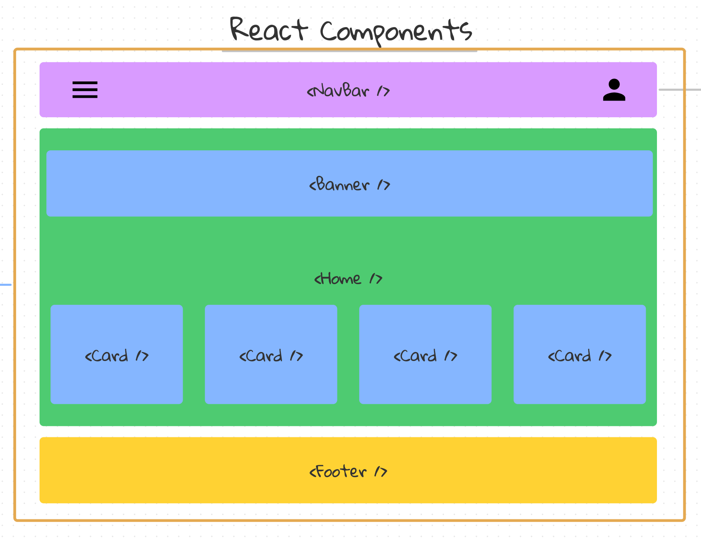
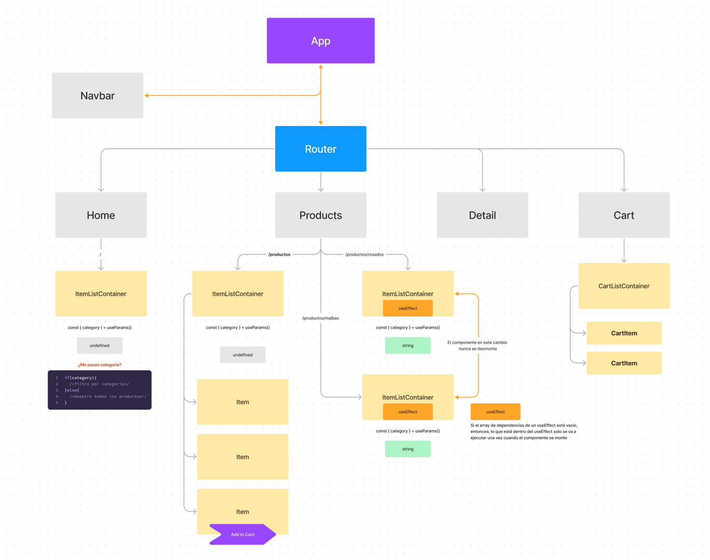
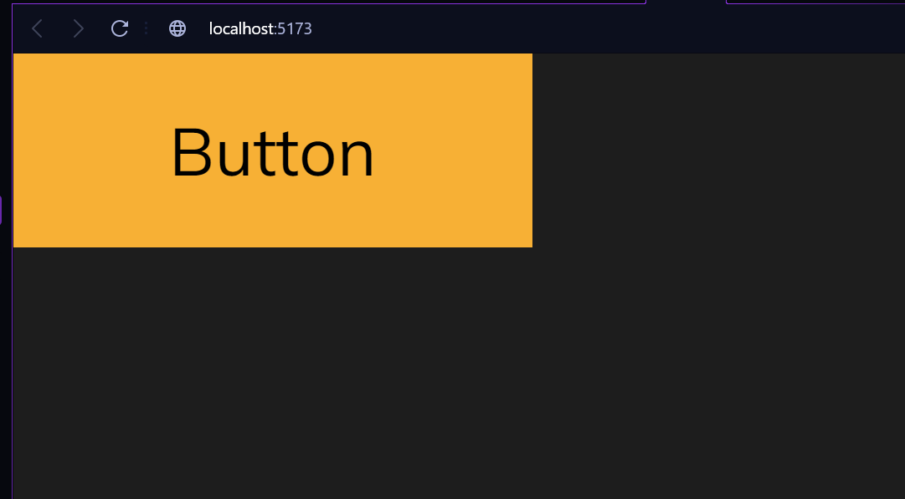

# Componentes

Los componentes son los elementos básicos de cualquier aplicación React. Ellos son como Funciones de JavaScript que aceptan entradas arbitrarias (Props) y devuelven Elementos React que describen lo que debe mostrarse en la pantalla.

Lo primero que hay que entender es que todo lo que aparece en pantalla en una aplicación React es parte de un componente. Esencialmente, una aplicación React son solo componentes dentro de otros componentes.

Los componentes te permiten dividir tu interfaz de usuario en piezas independientes y reutilizables.

No está por demás citar esta dicho:

> **Los desarrolladores de React no crean páginas, construyen componentes.**



En la imagen anterior podemos ver un ejemplo de cómo se vería una aplicación React en su forma más básica. En este caso, tenemos un componente `App` que contiene 3 componentes, <Navbar />, <Home /> y <Footer />. A su vez el componente <Home /> contiene 2 grupos de componentes, un <Banner /> y unos componentes <Card /> representado cards de productos.

## Árbol de componentes

En React, los componentes se organizan en un árbol jerárquico. Esto significa que cada componente puede tener cero o más componentes hijos.

Una forma muy sencilla de representar un árbol de componentes es con un diagrama de flujo. En el siguiente diagrama podemos ver un ejemplo de cómo se vería un árbol de componentes en React.



No es necesario que comprendas todos los componentes que aparecen en el diagrama, pero sí es importante que entiendas la estructura del árbol de componentes.

## Anatomía de un componente

Cómo mencionamos anteriormente, los componentes son como funciones de JavaScript que aceptan entradas arbitrarias (Props) y devuelven Elementos React que describen lo que debe mostrarse en la pantalla.

En React, tenemos dos formas de crear componentes: **funcionales** y **de clase**. En este capítulo veremos por única vez los componentes de clase, pero a partir del siguiente capítulo nos enfocaremos solo en los componentes funcionales.

### Componentes de clase

Los componentes de clase son la forma más antigua de crear componentes en React. Aunque aún se pueden usar, no es recomendable hacerlo, ya que los componentes funcionales son más simples y fáciles de usar.

Para crear un componente de clase, debemos crear una clase que extienda de `React.Component`. Esta clase debe tener un método `render()` que devuelva un elemento React.

#### Ejemplo de componente Button

```jsx
// Importamos React
import React from "react";

// Creamos un componente de clase llamado Button
class Button extends React.Component {
  // Button hereda de React.Component ciertas funcionalidades
  render() {
    // render es un método que devuelve un elemento React
    return (
      // Devolvemos un elemento React
      <button>{this.props.text}</button>
    );
  }
}

export default Button;
```

En el ejemplo anterior, creamos un componente `Button` que extiende de `React.Component`. Este componente recibe una prop `text` que se utiliza para renderizar el texto del botón. Veremos más sobre los props en el siguiente capítulo, pero quiero que veas que las props se acceden a través de `this.props`.

### Componentes funcionales

Los componentes funcionales son la forma más moderna de crear componentes en React. A diferencia de los componentes de clase, los componentes funcionales son funciones de JavaScript que devuelven un elemento React.

#### Ejemplo de componente Button (función regular)

```jsx
// Creamos un componente funcional llamado Button
function Button(props) {
  // Devolvemos un elemento React
  return <button>{props.text}</button>;
}

export default Button;
```

Como se puede apreciar, hemos creado un componente `Button` que es una función de JavaScript que devuelve un elemento React. Este componente, al igual que el ejemplo con clases recibe una prop `text` que se utiliza para renderizar el texto del botón. Veremos más sobre los props pero por el momento solo ten en cuenta que una prop es equivalente a un parámetro que enviamos a una función.

#### Ejemplo de componente Button (función flecha)

```jsx
// Creamos un componente funcional llamado Button
const Button = (props) => {
  // Devolvemos un elemento React
  return <button>{props.text}</button>;
};

export default Button;
```

También podemos crear componentes funcionales utilizando funciones flecha. Por lo general, este es el método que utilizaremos para crear componentes funcionales.

<div style="background-color: #31708f; color: #FFFFFF; border-radius: 12px; padding: 16px">
    <h4 style="margin: 10px 0">Actividad propuesta:  <i style="font-weight: normal">Crear un componente Button.jsx</i>   </h4>
</div>

Vamos a crear un componente que represente un botón. Por el momento solo mostrará un texto fijo pero luego lo haremos dinámico utilizando props en la siguiente sección.

Para ello, vamos a crear un archivo `Button.jsx` y otro archivo `Button.css` dentro de la carpeta `src/components/Button`. La estructura de carpetas debe quedar así:

```
src
└── components
    └── Button
        └── Button.jsx
        └── Button.css
```

En el archivo `Button.jsx` vamos a crear un componente funcional que devuelva un elemento `button` con el texto "Button". En el archivo `Button.css` vamos a agregar estilos para el botón.

#### 🔎 Pista de la solución

```jsx
// Button.jsx
import "./Button.css";

function Button() {
  return <button>Button</button>;
}

export default Button;
```

```css
/* Button.css */
.button {
  padding: 10px 30px;
  font-family: "Mulish", sans-serif;
  cursor: pointer;
  transition: all 0.3s ease-in-out;
}

.button--primary {
  background-color: var(--primary-color);
  color: var(--just-black);
  border: 1px solid var(--primary-color);
}

.button--primary:hover {
  background-color: #00000035;
  color: var(--primary-color);
  border: 1px solid var(--primary-color);
}
```

Ahora, vamos a importar el componente `Button` en `App.jsx` y lo vamos a renderizar en pantalla.

```jsx
// App.jsx
import './App.css'
import Button from './components/Button/Button'

function App() {

  return (
    <div>
      <Button />
    </div>
  )
}

export default App
```


#### 🚀 Resultado




Como se puede observar, hemos creado un componente `Button` que devuelve un elemento `button` con el texto "Button". También hemos agregado estilos para el botón utilizando CSS.


## Resumen

- En esta sección aprendimos sobre los componentes en React. Vimos que los componentes son como funciones de JavaScript que aceptan entradas arbitrarias (Props) y devuelven Elementos React que describen lo que debe mostrarse en la pantalla.

- También aprendimos que existen dos formas de crear componentes en React: **funcionales** y **de clase**. En este capítulo vimos un ejemplo de cada uno de ellos, pero a partir del siguiente capítulo nos enfocaremos solo en los componentes funcionales.

- Por último, creamos un componente `Button` que devuelve un elemento `button` con el texto "Button". También agregamos estilos para el botón utilizando CSS.

## ¿Qué sigue?

En la siguiente sección vamos a aprender sobre los Props en React. Veremos cómo pasar datos a los componentes utilizando props y cómo utilizarlos dentro de los componentes. También veremos cómo utilizar props para hacer que nuestros componentes sean más reutilizables.

