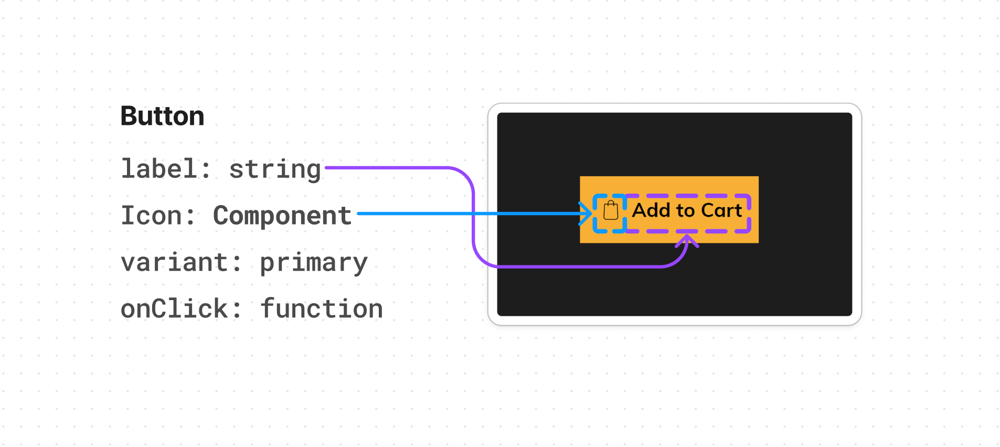
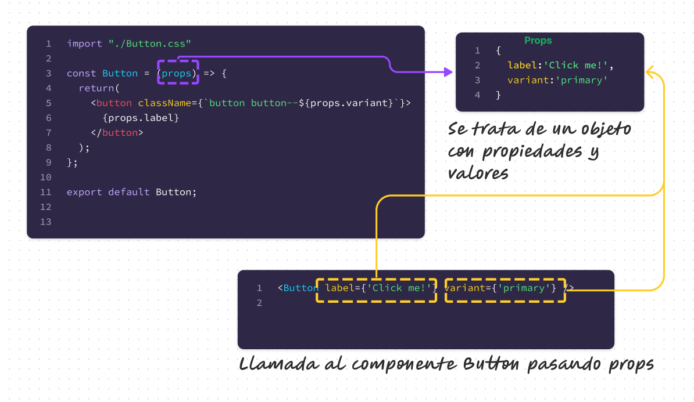
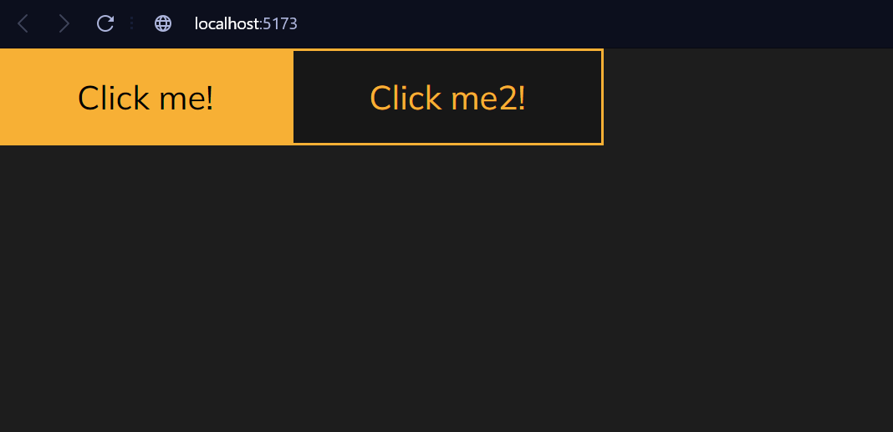
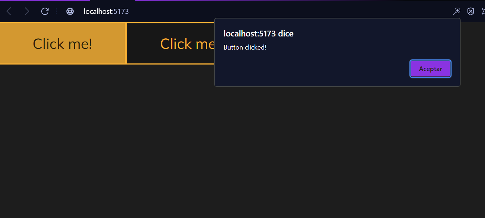
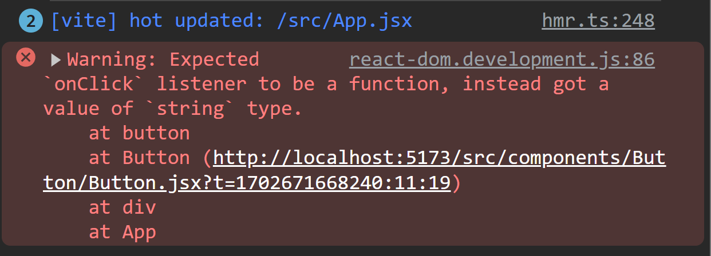

# Props

En la sección anterior creamos un componente `Button` que representaba un botón. Sin embargo, este componente no era muy útil porque siempre mostraba el mismo texto o el mismo color. En esta sección vamos a aprender a hacer que nuestros componentes sean más dinámicos usando props.

## ¿Qué son los Props?

Las “props” son una forma abreviada de propiedades, y simplemente se refieren a los datos internos de un componente en React. Se escriben dentro de llamadas a componentes y se pasan a componentes.

Las props son argumentos que se pasan a un componente. Son como los argumentos de una función, pero para componentes de React.

Además las props son la forma de comunicación entre componentes. Si queremos pasar datos de un componente a otro, lo hacemos a través de props desde su componente padre al componente hijo.

## ¿Cómo se ven los Props?

Para ilustrar cómo las props se ven en la práctica, podemos considerar el siguiente componente `Button`:



Cómo se puede observar, este componente recibe 4 props:

- **label**: que es el texto que se va a mostrar en el botón.
- **variant**: que es el tipo de botón que se va a mostrar. Puede ser `primary` o `secondary` por ejemplo.
- **onClick**: que es la función que se va a ejecutar cuando se haga click en el botón.
- **Icon**: que es el ícono que se va a mostrar en el botón.

## ¿Cómo se utilizan los Props?

Tal vez te estés preguntando ¿Cómo se pasan las props a un componente? Bueno, las props se pasan como argumentos a los componentes. Por ejemplo, si queremos pasarle la prop `label` al componente `Button`, lo hacemos de la siguiente manera:

```jsx
import "./Button.css";

const Button = (props) => {
  return (
    <button className={`button button--${props.variant}`}>{prosp.label}</button>
  );
};

export default Button;
```

Como se puede observar, las props se pasan como argumentos a la función `Button`. Luego, dentro del componente, podemos acceder a las props utilizando la sintaxis `props.nombreDeLaProp`.

Ahora, cuando queremos utilizar el componente `Button` en otro componente, podemos pasarle las props de la siguiente manera:

```jsx
// App.jsx
import "./App.css";
import Button from "./components/Button/Button";

function App() {
  return (
    <div>
      <Button label={"Click me!"} variant={"primary"} />
    </div>
  );
}

export default App;
```

Como se puede observar, las props se pasan como atributos al componente `Button`. En este caso, le pasamos las props `label` y `variant` al componente `Button`.



## Desestructuración de Props en componentes funcionales

En el ejemplo anterior, vimos cómo acceder a las props utilizando la sintaxis `props.nombreDeLaProp`. Sin embargo, existe una forma más conveniente de acceder a las props en componentes funcionales. Esta forma es utilizando la desestructuración de objetos.

La desestructuración de objetos es una característica de JavaScript que nos permite extraer datos de un objeto y asignarlos a variables. Por ejemplo, si tenemos el siguiente objeto:

```jsx
const person = {
  name: "John",
  age: 30,
  city: "New York",
};
```

Podemos extraer los datos del objeto y asignarlos a variables de la siguiente manera:

```jsx
const { name, age, city } = person;
```

Ahora, podemos acceder a los datos del objeto utilizando las variables `name`, `age` y `city`:

```jsx
console.log(name); // John
console.log(age); // 30
console.log(city); // New York
```

De la misma manera, podemos utilizar la desestructuración de objetos para acceder a las props en componentes funcionales. Por ejemplo, si queremos acceder a la prop `label` en el componente `Button`, podemos hacerlo de la siguiente manera:

```jsx
import "./Button.css";

const Button = (props) => {
  const { label, variant } = props;

  return <button className={`button button--${props.variant}`}>{label}</button>;
};

export default Button;
```

Como se puede observar, primero desestructuramos el objeto `props` y luego accedemos a las props utilizando las variables `label` y `variant`.

Además, podemos utilizar la desestructuración de objetos para acceder a las props directamente en los argumentos de la función. Por ejemplo, podemos hacer lo siguiente:

```jsx
import "./Button.css";

const Button = ({ label, variant }) => {
  return <button className={`button button--${props.variant}`}>{label}</button>;
};

export default Button;
```

Como se puede observar, la desestructuración del objeto `props` se realiza directamente en los argumentos de la función. De esta manera, podemos acceder a las props utilizando las variables `label` y `variant`.

## Reutilización de componentes con Props

Una de las ventajas de utilizar props es que nos permite reutilizar componentes. Por ejemplo, si queremos crear un botón secundario, podemos reutilizar el componente `Button` y pasarle la prop `variant` con el valor `secondary`:

Para poder aplicar este ejemplo, primero generaremos una clase CSS para el botón secundario:

```css
/* Button.css */
.button {
  padding: 10px 30px;
  font-family: "Mulish", sans-serif;
  cursor: pointer;
  transition: all 0.3s ease-in-out;
}

.button--primary {
  background-color: var(--primary-color);
  color: var(--just-black);
  border: 1px solid var(--primary-color);
}

.button--primary:hover {
  background-color: #00000035;
  color: var(--primary-color);
  border: 1px solid var(--primary-color);
}

.button--secondary {
  background-color: #00000035;
  color: var(--primary-color);
  border: 1px solid var(--primary-color);
}

.button--secondary:hover {
  background-color: var(--primary-color);
  color: var(--just-black);
  border: 1px solid var(--primary-color);
}
```

Luego, podemos reutilizar el componente `Button` y pasarle la prop `variant` con el valor `secondary`:

```jsx
// App.jsx

import './App.css'
import Button from './components/Button/Button'

function App() {

  return (
    <div>
      <Button label={'Click me!'} variant={'primary'} />
      <Button label={'Click me2!'} variant={'secondary'} />
    </div>
  )
}

export default App
```

Lo que veremos renderizado será lo siguiente:



Esta es una de las ventajas de utilizar props. Nos permite reutilizar componentes y hacerlos más dinámicos. Nuestro componente `Button` ahora es más útil porque podemos utilizarlo para crear botones primarios y secundarios. También podemos utilizarlo para crear botones con diferentes textos.

## Pasar una función como prop

En el ejemplo anterior, vimos cómo pasarle una prop al componente `Button`. Sin embargo, también podemos pasarle una función como prop. Por ejemplo, si queremos que el componente `Button` ejecute una función cuando se haga click en el botón, podemos hacer lo siguiente:

```jsx
// App.jsx

import './App.css'

import Button from './components/Button/Button'

function App() {

  const handleClick = () => {
    alert('Button clicked!')
  }

  return (
    <div>
      <Button label={'Click me!'} variant={'primary'} onClick={handleClick} />
    </div>
  )
}

export default App
```

Como se puede observar, le pasamos la función `handleClick` al componente `Button` utilizando la prop `onClick`. Luego, dentro del componente `Button`, podemos acceder a la función utilizando la sintaxis `props.onClick`:

```jsx
// Button.jsx

import './Button.css'

const Button = ({ label, variant, onClick }) => {

  return (
    <button className={`button button--${variant}`} onClick={onClick}>
      {label}
    </button>
  )
}

export default Button
```

Como se puede observar, podemos acceder a la función `handleClick` utilizando la sintaxis `props.onClick`. De esta manera, cuando se haga click en el botón, se ejecutará la función `handleClick`.



### Evento onClick

React soporta eventos en su sintaxis JSX. Los eventos de React son muy similares a los eventos de HTML. Sin embargo, hay algunas diferencias sintácticas:

- Los eventos de React se nombran utilizando camelCase, en lugar de minúsculas.
- Con JSX, pasamos una función como el manejador del evento, en lugar de una cadena.

Sintaxis de eventos en JSX:

```jsx
<button onClick={handleClick}>Click me!</button>
```

## Implementando PropTypes a nuestro componente

Los PropTypes son una característica de React que nos permite validar las props de un componente. Nos permiten especificar qué tipo de datos deben ser las props y si son requeridas o no.

Por ejemplo, si queremos especificar que la prop `label` del componente `Button` debe ser de tipo `string` y que la prop `variant` debe ser de tipo `string` y requerida, podemos hacer lo siguiente:

```jsx
// Button.jsx
import "./Button.css";
import PropTypes from 'prop-types'

const Button = ({ label, variant, onClick }) => {
  return (
    <button className={`button button--${variant}`} onClick={onClick}>
      {label}
    </button>
  );
};

Button.propTypes = {
  label: PropTypes.string,
  variant: PropTypes.string.isRequired,
  onClick: PropTypes.func,
};

export default Button;
```

Como se puede observar, importamos el paquete `prop-types` y luego especificamos los PropTypes de las props del componente `Button`. En este caso, especificamos que la prop `label` debe ser de tipo `string`, que la prop `variant` debe ser de tipo `string` y requerida y que la prop `onClick` debe ser de tipo `func`.

Ahora, si intentamos pasarle un valor incorrecto a la prop `variant`, veremos un error en la consola:

```jsx
// App.jsx
import "./App.css";
import Button from "./components/Button/Button";

function App() {

  const handleClick = () => {
    alert("Button clicked!");
  };

  return (
    <div>
      <Button label={"Click me!"} variant={"primary"} onClick={handleClick}/>
      <Button label={"Click me2!"} variant={"secondary"} onClick={'wjdwhjd'}/>
    </div>
  );
}

export default App;
```



Como se puede ver en la imagen nos indica que la prop `onClick` debe ser de tipo `func` y no de tipo `string`.

### Props requeridas

También podemos especificar que una prop es requerida. Por ejemplo, si queremos especificar que la prop `variant` del componente `Button` es requerida, podemos hacer lo siguiente:

```jsx
// Button.jsx

import "./Button.css";
import PropTypes from 'prop-types'

const Button = ({ label, variant, onClick }) => {
  return (
    <button className={`button button--${variant}`} onClick={onClick}>
      {label}
    </button>
  );
};

Button.propTypes = {
  label: PropTypes.string,
  variant: PropTypes.string.isRequired,
  onClick: PropTypes.func,
};

export default Button;
```

Como se puede observar, especificamos que la prop `variant` es requerida utilizando la sintaxis `PropTypes.string.isRequired`.

Ahora, si intentamos utilizar el componente `Button` sin pasarle la prop `variant`, veremos un error en la consola que nos indica que la prop `variant` es requerida.

### Valores por defecto

También podemos especificar valores por defecto para las props. Por ejemplo, si queremos especificar que la prop `variant` del componente `Button` tiene el valor por defecto `primary`, podemos hacer lo siguiente:

```jsx

// Button.jsx

import "./Button.css";

const Button = ({ label, variant, onClick }) => {
  return (
    <button className={`button button--${variant}`} onClick={onClick}>
      {label}
    </button>
  );
};

Button.propTypes = {
  label: PropTypes.string,
  variant: PropTypes.string.isRequired,
  onClick: PropTypes.func,
};

Button.defaultProps = {
  label: "Button",
  variant: "primary",
  onClick: () => {},
};

export default Button;
```

Como se puede observar, especificamos los valores por defecto de las props utilizando la sintaxis `Componente.defaultProps`.

## Resumen

- En esta sección aprendimos sobre los Props en React. Vimos que los Props son argumentos que se pasan a un componente. Son como los argumentos de una función, pero para componentes de React.
- También aprendimos que existen dos formas de acceder a las props en componentes funcionales: utilizando la sintaxis `props.nombreDeLaProp` o utilizando la desestructuración de objetos.
- Además, aprendimos que los Props nos permiten reutilizar componentes y hacerlos más dinámicos. Por ejemplo, podemos utilizar props para crear botones primarios y secundarios.
- Por último, aprendimos sobre los PropTypes en React. Vimos que los PropTypes nos permiten validar las props de un componente. Nos permiten especificar qué tipo de datos deben ser las props y si son requeridas o no.

En la siguiente vamos a aprender sobre los Estados en React. Veremos cómo crear estados en componentes funcionales y cómo utilizarlos para hacer que nuestros componentes sean más dinámicos.
