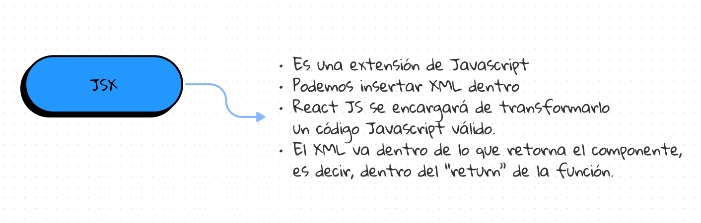

# Repaso de curso de React JS

## ¿Qué es React?

React js es una librería de JavaScript para construir interfaces de usuario. Es decir, es una herramienta que nos permite crear interfaces de usuario de forma rápida y sencilla. Está enfocado en componentes.


## Los pilares de React JS

Podríamos resumir a React JS en 3 simples palabras:

* **Components:** React JS está enfocado en componentes. Un componente es una pieza de código que se puede reutilizar. Es decir, es un bloque de código que se puede usar en diferentes partes de la aplicación. Por ejemplo, un componente puede ser un botón, un input, un formulario, etc.
* **Props:** Las props son propiedades que se le pueden pasar a un componente. Por ejemplo, si tenemos un componente de botón, podemos pasarle una prop de color, para que el botón sea de ese color.
* **States:** El estado es la forma en la que React JS maneja los datos. Es decir, es la forma en la que React JS maneja la información que se muestra en la interfaz de usuario. Por ejemplo, si tenemos un componente de botón, podemos tener un estado que sea el contador de clicks. Cada vez que se haga click en el botón, el estado se actualizará y el contador aumentará en 1.


## Componentes

Los componentes son bloques de código que se pueden reutilizar en diferentes partes de la aplicación. Por ejemplo, un componente puede ser un botón, un input, un formulario, etc. Los componentes son los elementos básicos de cualquier aplicación React. Ellos son como Funciones de JavaScript que aceptan entradas arbitrarias (Props) y devuelven Elementos React que describen lo que debe mostrarse en la pantalla.

## Props

Las “props” son una forma abreviada de propiedades, y simplemente se refieren a los datos internos de un componente en React. Se escriben dentro de llamadas a componentes y se pasan a componentes. Dos cosas que vale la pena recordar sobre las props:

- En primer lugar, determinamos el valor de una “prop” y lo usamos como parte del plano antes de que se construya el componente.
- En segundo lugar, el valor de una prop nunca cambiará, es decir, las props son de solo lectura una vez que se pasan a los componentes.
- La forma de acceder a una prop es haciendo referencia a ella a través del parámetro que por convención llamamos “props”.


## Acerca de .jsx

JSX es una extensión de JavaScript creada por Facebook para el uso con la biblioteca React. Sirve de preprocesador (como Sass o Stylus a CSS) y transforma el código generado con React a JavaScript.

Con JSX podemos escribir una sintáxis especial en la cual podríamos considerar que estamos trabajando con JavaScript y HTML, sin embargo lo que en realidad está devolviendo el componente es un XML, el cuál posteriormente será transformado a JavaScript.




## Propuesta del curso

Durante el curso se propone trabajar con un proyecto llamado Kong Beer el cual es un e-commerce de cervezas. El proyecto se encuentra en el siguiente repositorio de GitHub:

- Repositorio del curso: [https://github.com/joshuacba08/ibec-reactjs-072023](https://github.com/joshuacba08/ibec-reactjs-072023)
- Libro del curso: [https://github.com/joshuacba08/React-Book-Kong-Beer](https://github.com/joshuacba08/React-Book-Kong-Beer)

## ¿Por dónde empezar?

### Definir la estructura del proyecto

Cuando creamos un proyecto con Vite, se nos crea una estructura de carpetas y archivos por defecto. Sin embargo, también debemos añadir nuestra propia estructura para controlar mejor el flujo de trabajo. Por ejemplo, podemos crear una carpeta llamada `components` para almacenar todos los componentes de nuestra aplicación. También podemos crear una carpeta llamada `pages` para almacenar todas las páginas de nuestra aplicación. Y así sucesivamente.

###### Estructura del proyecto

```bash
kong-beer
├── public
│   ├── favicon.ico
│   └── index.html
├── src
│   ├── components
│   │   └── Button
│   │       ├── Button.css
│   │       └── Button.jsx
│   ├── pages
│   │   └── Home
│   │       ├── Home.css
│   │       └── Home.jsx
|   ├── Context
│   │   └── CartContext.jsx
│   ├── Layouts
│   │   └── Navbar
│   │       ├── Navbar.css
│   │       └── Navbar.jsx
│   ├── App.css
│   ├── App.jsx
│   ├── index.css
│   └── main.jsx
|-- index.html
├── .gitignore
├── package.json
├── README.md
├── vite.config.js
```

Como se puede apreciar usamos la carpeta `components` para almacenar todos los componentes de nuestra aplicación. También usamos la carpeta `pages` para almacenar todas las páginas de nuestra aplicación. Y por último, usamos la carpeta `src` para almacenar todos los archivos de código fuente de nuestra aplicación.


